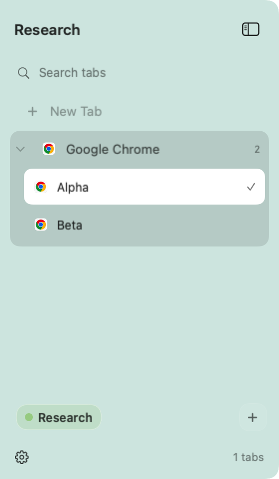
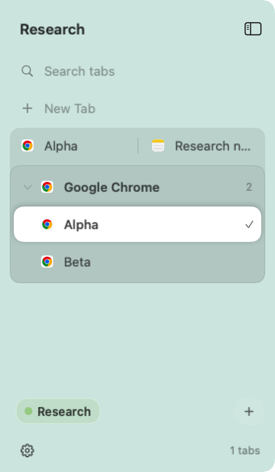

# Browser tabs in Tabs mode

The expanded Tabs sidebar can list the tabs inside a Safari or compatible Chrome,
Chromium, Brave, or Edge window. A window with two or more readable tabs becomes a
browser group, drawn like the sidebar's other groups: the window's row heads it, and
its tabs are listed beneath. Selecting a child switches the browser tab and focuses
its owning window. Middle-click a child, hover it and click **×**, or choose **Close
Tab** from its menu to close that browser tab. A real split keeps its side-by-side
window row, with browser children below. Search matches browser tab titles; arrow
keys and Enter select the matching child.

The browser remains one managed window. Browser children do not create workspaces
or change tiling, projects, pins, or saved layouts. The active group stays expanded.
Pinned tiles and the compact rail continue representing whole windows; browser
children appear in the expanded list and search.

`workspace-sidebar.browser-tabs` defaults to `true`. Turn off **Show browser tabs**
in Settings to restore ordinary window rows. This uses the Accessibility permission
WinMux already needs; it does not request Automation or require an extension. The
optional [Safari extension](#safari-extension) adds website icons, host names and sound.
The optional [Chrome extension](#chrome-extension) adds host names and event-driven metadata.
Both report changes as events. Selection in either browser can use a confirmed extension
connection with separate native-window and row ownership proof: the extension's toolbar button
in that very window must name it. Otherwise selection, and Chrome's sound, stay on Accessibility.

## Sound

A speaker on a tab's row or pinned tile shows that its window is playing sound. macOS reports
sound only per app, so WinMux asks the browser's tabs which window it comes from:

- **Safari:** a tab playing sound shows a mute button, and a window without a tab bar shows a
  speaker in its address field. WinMux reads both along with the tabs it already reads. Only a
  window with such a tab shows the speaker. The address field's speaker also appears on a silent
  page, to mute a tab playing elsewhere, and only its English words say which, so in another
  language a window without a tab bar says nothing about its sound. With the [WinMux Tabs extension](#safari-extension),
  what the extension says about a tab wins while it describes the window, and windows it describes
  as silent show none, even while Safari plays elsewhere, such as in a Private Browsing window.
  Safari's words tell a muted tab from a playing one only in English; in other languages a muted
  tab shows the plain speaker.
- **Chrome, Chromium, Brave, and Edge:** a tab playing sound has "Audio playing" (or "Audio
  muted") at the end of its accessible name, in the browser's language. WinMux knows the
  wording in every language Chrome 154 ships, and takes it off the title it shows.
- **Other apps**, including Firefox and Arc, show their sound on every window, as before. For an
  app with one window, that's already exact.

When a tab says it plays, only its window shows the speaker; the app's other windows show none.
A tab that doesn't may still be playing: a camera recording or picture in picture replaces
Chromium's label, and a window WinMux hasn't read says nothing. So while no tab says it plays,
every window of the app shows its sound, except windows the Safari extension describes as silent.
When a browser starts or stops playing, WinMux reads its listed windows again right away.

A muted tab, and its window, show a speaker with a slash. Chrome labels a tab muted only while
it's trying to play; the extension reports every muted Safari tab. Pinned tiles are read like
listed windows so they can show this too. A window the sidebar stops listing keeps its tabs'
sound for ten seconds at most.

## Website icons

**Website icons for Chrome-family tabs** (`workspace-sidebar.browser-tab-icons`) is off by
default. When enabled, icons appear as tabs are selected in listed windows. Unvisited tabs, unsupported
addresses, and failed downloads use the browser's app icon. Safari tabs get their icons from
the [WinMux Tabs extension](#safari-extension) instead; this setting doesn't affect them.

A browser window with one tab isn't a group, so its row and pinned tile show that tab's
website icon in place of the browser's, at the same size, once the icon is known. A window
with more tabs keeps the browser's icon on its row, above its tabs' own icons.

WinMux reads the window's document address and keeps only its HTTPS
origin, after two consistent observations. It requests `/favicon.ico`, then
`/apple-touch-icon.png`, directly from that origin. It never requests the page URL
or uses a third-party icon service. Downloads use no cookies or saved credentials,
stay on the same origin, and have time, byte, concurrency, and image-size limits.
Tab metadata and these icons remain in memory and are cleared when the feature is disabled;
they are never written to disk.

These requests include Incognito windows and do not use browser proxy settings,
VPN extensions, or secure DNS. Obvious local addresses are excluded; a domain that
resolves to a local device could still trigger macOS's Local Network prompt. Safari
website icons are excluded because a direct request could bypass iCloud Private Relay.
Without the [Chrome extension](#chrome-extension), background navigation can leave the previous
site's icon until the tab is visited. With it, a Chrome tab shows its origin icon only from a read
that started after the latest page change WinMux knows of: the extension's live report gives each
tab's origin and page revision, which changes with every address the tab commits, even on the same
origin. A tab whose report names another revision, another origin (scheme, host or port) or no
website shows the app icon until such a read confirms its icon, and that holds even if the report
or the tab's pairing then goes. Reads confirm only a window's selected tab, so a tab that navigates
in the background shows the app icon until it's selected. While no live report has the tab, or
with an extension from before page revisions, only the selected tab shows its icon, while its
window's latest read still finds it at that origin.
Selecting an ineligible address replaces a known website icon with the app icon
after the address is confirmed.

## Safari extension

WinMux includes **WinMux Tabs**, a Safari web extension. It shows each Safari tab's website
icon, including tabs you haven't selected since WinMux started, and a speaker on tabs
playing sound or muted. Search also matches a Safari tab's host name. It needs Safari 18.4
or later: turn it on in Safari's **Settings › Extensions** and allow it on every website.
Without that access Safari hides tabs' titles from the extension, and those tabs keep
Safari's icon. Settings › Workspace Panel › Tabs › Content shows whether it's reporting and
opens Safari's extension settings.

The extension titles its own toolbar button (below). With the event protocol described below,
selection can use the extension only when its current toolbar marker positively identifies
the clicked native window and a later no-reorder report plus AX read corroborates the row’s
stable native handle and extension tab id. A metadata match by title, order or active tab
never authorizes a command. Without this separate proof, selection uses Accessibility. Closing still uses Accessibility. WinMux trusts an
extension description only when it agrees with the tab strip it read:

- A Safari window takes the extension's details only when it has the same tabs, in the same
  order, with the same tab selected, and no other window matches as well. A match must hold
  across two Accessibility reads 0.75 seconds apart.
- The extension's toolbar button in each window names that window: WinMux reads its title along
  with the tab bar, and a window whose button names a window of the latest report is that one,
  wherever it is, even among twins in the same place. The title must come from that report's
  extension session, name the tab the report says is active there, and the window's tabs must
  agree. A tab keeps its title when it moves to another window, until the extension titles it
  again, so a title counts only once a report Safari measured after the read that saw it still
  agrees, with no tab moved, opened or closed in between; WinMux's answer asks Safari for that
  report, so this takes a few seconds. A title naming anything else (the button hasn't caught up
  with a switch, a tab moved, or the extension reloaded) names nothing, nor does one two windows
  show at once. Those windows, and windows without the button, are matched by the rules below.
  WinMux only reads the button. A currently trusted marker is required for extension selection
  in this Preview; bounds-based metadata matches alone use AX. Closing and moving retain
  their existing Accessibility paths.
- Two windows with the same tabs, such as two one-tab windows on the same page, are told apart
  by where they were when Safari reported. WinMux notes where Safari's windows are a few times
  a second, and compares the bounds in each report only with where windows were when that
  report arrived, never with where they are now: WinMux moves windows (switching tabs parks one
  in a corner) and Safari doesn't report that. The extension notes when it begins measuring,
  and a window that moved, resized or reopened since just before then, or while the report was
  on its way, counts as unknown. The one paired must have been where Safari says, and every
  other twin seen elsewhere; an unknown twin could have been anywhere. If the report doesn't
  settle which twin is which, both keep Safari's icon and no sound, and WinMux asks Safari to
  report again when a newer report could settle it: in its answer to a report, which has the
  extension report again two seconds later (at once, then less often while the wait lasts, down to once a minute), as Safari 27.0 didn't
  wake the extension for a separate request. Twins that are
  in the same place in every report stay that way, and so do twins described by an extension
  from before this, whose reports don't say when it measured.
- While some Safari window hasn't been read (one the sidebar doesn't show, or one whose tab
  strip couldn't be read yet), a new match also needs the window, and no unread window, to
  have been where Safari says, since the unread window could be the real twin.
- Once made, a match holds as long as its tabs agree and Safari still reports that window,
  however WinMux moves it, and no other window can take its report. Only a window's button
  naming another report, or a later report that pairs the window, or that report, with another
  by where they were, replaces it. A window that
  closes, and a later one that gets its number, start over, and a window that opened after
  Safari measured a report isn't matched by that report.
- Within a matched window, each tab is matched with Safari's tab by Safari's id for it. A read
  made after a report pairs a tab with the one in its place; after that it keeps that tab while
  the tab bar is reordered, so tabs with the same title don't trade icons or sound. Among tabs
  with the same title, a read only proposes a pairing (it may have caught a reorder Safari
  hadn't reported yet). It counts once a report Safari measured after that read, and a read
  begun after the report arrived, still agree, and Safari's next report says no tab was moved,
  opened or closed in between. WinMux's answers ask Safari for those reports, so their sound
  follows their icons by seconds rather than waiting for Safari's once-a-minute check-in. A tab whose Safari tab is gone, or whose title no longer matches it,
  shows nothing from the extension until a read pairs it again. An extension from before tab
  ids matches them by position.
- A window that briefly stops matching, such as while a title changes, keeps its icons for up
  to ten seconds. It hides sound at once.
- A tab whose title Safari withholds from the extension (a start page, or a site without
  access) can differ, as long as the window has at least as many matching titles.
- Safari hides the tab bar of a window with one tab. WinMux reads such a window as that one
  tab, named by the window's title, and matches it with the extension's one-tab window of that
  title, by the rules above. To keep reads light, it reads just the window's title, and walks
  its controls again only when the title changes (as it does when a tab opens), when Safari
  starts or stops playing sound, and at least every 30 seconds.

What leaves Safari: for each tab in a normal window, its id (a number Safari gives it until
Safari quits), title, host name and origin (never the path or query), page revision (below),
whether it's active, pinned, playing sound or muted, and its icon as a 32-pixel PNG; each window's id and place on screen; and
how many times tabs were moved, opened or closed since Safari started, with when the extension
began measuring.
Private Browsing windows are left out entirely, even when the extension is allowed in them.
The extension sends these reports to WinMux on this Mac when tabs change, a second after a
Safari window gains focus (once WinMux has moved its windows), and when WinMux's answer asks
for another, leaving out one that would say nothing new; and once a minute regardless. WinMux
keeps them in memory, with up to 512 icons; it never drops one a tab shows. Each window expires
two and a half minutes after its own last report; activity in another window cannot renew it.
It forgets a Safari profile that stops reporting after two and a half minutes, and forgets everything when Safari quits or browser tabs are turned off.

### The toolbar button's title

So WinMux can tell which Safari window is which, the extension titles its toolbar button in
each normal window, through the title of that window's active tab: **WinMux Tabs ·** followed
by the first 8 characters of the extension's session (a random identifier it makes each time
Safari starts it), Safari's id for the window and its id for the tab, such as
`WinMux Tabs · 3f2a9c1e-1401-1402`. The title holds no page titles or addresses, and Private
Browsing windows keep the plain name. It's the button's tooltip, and VoiceOver reads it as the
button's name, so you'll see and hear those numbers there. A new tab shows the plain name until
the extension titles it, a moment after it becomes active. The title is visible in the
tooltip and readable by any app with Accessibility access, like the rest of Safari's window.

Without the button (removed with **View › Customize Toolbar**, or moved into the toolbar's
overflow menu in a narrow window), WinMux matches windows only by their tabs and where they
were, as above, and twins in the same place keep Safari's icon.

### How often WinMux reads Safari's tabs

WinMux reads a listed browser window's tab bar every second while it's focused and every four
seconds otherwise, and soon after an Accessibility notification. A Safari window the extension
describes in full, by a report from the last minute and a half, with access to every website,
is read only every 15 seconds, and within a second of an Accessibility notification: the
extension reports when its tabs change, and a report that no longer agrees with the last read
reads the window again at once. Any other window, and every
window while the extension is off, waiting, stale or without access to every website, is read
as before.

Icons come from each page's own icon links, best near 32 pixels, then its `/favicon.ico`.
The extension fetches them inside Safari without cookies or a referrer, from the page's own
origin or a public HTTPS address; a page can't point it at a local network device. It doesn't
follow redirects, so an icon that redirects isn't used. Images above 256 KB or 1,024 pixels are
refused before they're decoded, and at most three fetches run at once. While WinMux isn't
running it fetches nothing; pages' icon links wait, and their icons are made once WinMux
answers again. Safari performs these requests itself, not WinMux, but they come from the extension
rather than the page, so they may not follow every setting Safari applies to browsing. The
icons stay in Safari's session storage, which it clears when it quits. A tab that hasn't
loaded since the extension started, such as one restored when Safari reopened, shows Safari's
icon until its page loads and names its icon; no other page's icon stands in
([below](#which-page-shows-which-icon-and-icon-images-kept-across-launches)).

The extension reaches WinMux through its native part, which Safari runs in a sandbox. That
part connects to a socket in the app group container WinMux and the extension share. Since
macOS 15, apps outside the group can't use that folder without asking you. WinMux checks
that each connecting process is signed as WinMux Tabs by WinMux's own team before it reads
anything. On macOS 13 and 14, another program running as you could
take the socket's place while WinMux isn't running and receive the extension's reports.

When WinMux updates, Safari reloads the extension, which starts with no icons. In testing
(Safari 27.0, a Developer ID–signed build), Safari also reloaded it each time WinMux started,
with a new session and new window and tab ids. The reloaded extension's first report can come
before WinMux listens, so a report WinMux doesn't take is tried again five seconds later, then
less often, up to once a minute: the extension reports, and titles its buttons, soon after
WinMux starts. Icons of pages open since before still wait until those pages reload. Pages opened
after that report theirs as usual, and a tab whose page hasn't reported shows Safari's icon. A
page that was already open may keep Safari's icon until it reloads:
the extension asks such pages to report again, but in testing Safari 27.0 didn't deliver their
reports.

### Which page shows which icon, and icon images kept across launches

The extension reports, for each tab, its origin (scheme, host and port; never the path or query)
and a page revision: an opaque token that changes every time the tab commits another address,
even one it had before. Each revision is a random value made when the extension's page loads,
plus a count, so no revision is ever made twice. WinMux shows a Safari tab's website icon only
while the live report for the tab's current page instance (the same tab in the same Safari
profile, extension session and stream, at the same origin and revision) names that icon. Never by
a title, host or origin alone, and nothing stands in for a page that hasn't named an icon of its
own:

- The extension gives a tab only the icon its current page made, bound to that page's revision.
  When the tab commits another address, it drops that icon and asks the page to name its icons
  again (a page that changed its address by script stays); such a page also names them again by
  itself a second after its history or fragment changes. An icon finished for a page the tab has
  since left, even if it came back to the same address, is discarded.
- Nothing about a page (its address, revision or icon) is kept when Safari unloads and reloads the
  extension's page: every tab's page is new, with a new revision and no icon, until it names its
  icons again. The reloaded page asks each open page to do so, and an image it already made from
  the same icon address in this browsing session isn't fetched again.
- **Keeping an icon through report gaps and disconnects isn't part of this release**; it's a
  tracked follow-up. While no live report has the tab (a report gap, or the extension
  disconnected), while the tab isn't paired with the extension (as right after the extension's
  page reloads, until WinMux pairs it again), or once the extension starts a new stream, the tab
  shows Safari's icon.
- An extension from before page revisions shows no website icons.

So Safari's icon shows more often than before: after report gaps, after WinMux or the extension
restarts, and each time Safari reloads the extension's page, until each page names its icon again;
and on pages that never do (one already open whose page doesn't answer, or one Safari restored
without loading).

WinMux also keeps icon images on disk, by the key the extension gives each icon (the SHA-256 of
its image), so a page that names an icon WinMux has had before, even before WinMux restarted,
shows it at once, without the extension sending it again. The images decide nothing about which
page shows which icon.
These are the 32-pixel images WinMux made from what the extension sent, each filed with the
SHA-256 of its bytes and checked when read, in `~/Library/Caches/<WinMux's bundle id>/BrowserTabIcons/`,
readable only by you. An index maps a keyed hash of the Safari profile and the icon's key to each
image, with a random key kept beside it, so no host name, address, title or page content is
written. The images themselves still show which sites they're for, and someone with access to
your files could test whether a given site's icon is kept.
Each Safari profile's icons stay its own, and nothing comes from Private Browsing, which the
extension never reports. At most 512 icons and 8 MB of images are kept, least recently used
first. An icon unused for 30 days is never shown again, and its image is deleted at the next
cleanup: when WinMux first reads the folder, whenever it writes an icon, and hourly while Safari
reports. Turning off **Show browser tabs** deletes them all; hiding the panel, another mode, or
pausing WinMux doesn't. What WinMux remembers in memory about which icons it read or wrote is
bounded too (about a thousand each, least recently used first), so browsing many sites doesn't
grow it.

This is a continuity improvement. It is **not** a fix for the historical MacBook Air favicon
issue, where a Safari 27 window with a collapsed tab group fell back to the whole window's row:
that cause is unchanged and untested here. Chrome icons aren't kept on disk: Chrome connections
have no profile identity that lasts across launches, and Accessibility reads can't tell an
Incognito window apart.

Safari 27.0 treated a Developer ID–signed build that wasn't notarized as unsigned, and listed it
only with unsigned extensions allowed; WinMux's releases are notarized. Development
builds from `swift build` or `make run` don't include the extension; only the Xcode-built app
(`make release`, `make install`) embeds it, and then only with a Developer ID signature and
team. See [Local development](development.md#build-an-app-and-matching-cli) to try one.

## Chrome extension

The Preview includes **WinMux Tabs for Chrome** (extension version 1.1.0), an optional Manifest V3
extension for Google Chrome 120 or later on macOS. Chrome Beta/Dev/Canary, Chromium, Brave and
Edge keep the existing Accessibility integration; the native-host registration targets Google
Chrome only. The version floor is an API requirement, not a claim of live testing across those
versions.

### Set up

Setup is explicit; installing or starting WinMux never registers a Chrome native host or copies
the extension:

1. Keep the Preview app at its intended location, normally `/Applications/WinMux.app`.
2. In WinMux, open **Settings › Workspace Panel › Tabs › Content** and choose **Set Up Chrome
   Extension…**. It registers WinMux's native-messaging host for your macOS account (running the
   embedded `winmux chrome-extension install`, which writes only
   `~/Library/Application Support/Google/Chrome/NativeMessagingHosts/com.zimengxiong.winmux.tabs.json`),
   copies the extension's files to `~/Library/Application Support/WinMux/WinMuxTabs-Chrome/`,
   shows that folder in Finder, and copies `chrome://extensions` for you.
3. In Chrome, open `chrome://extensions`, turn on Developer mode, choose **Load unpacked**, and
   select that folder. Its stable ID is `hnanakkjaimkfkpgmcoaglbgiiaohgbj`.
4. Pin **WinMux Tabs** from Chrome's Extensions menu (the puzzle piece). WinMux switches tabs
   through the extension only in windows where its button shows (below); elsewhere it uses
   Accessibility, as before.
5. Repeat steps 3 and 4 in each Chrome profile that should report, and keep **Show browser tabs**
   on in WinMux. Chrome starts a copy of the embedded CLI for each extension connection; it is a
   native-messaging helper, with no daemon or login item. A lost connection backs off, then
   reconnects with a full snapshot.

Without the app, download `WinMuxTabs-Chrome-VERSION.zip` from the release (its SHA-256 is in
`SHA256SUMS`), extract it to a permanent folder, and load that. The same zip is in the portable
`WinMux-VERSION-macOS.zip` and inside `WinMux.app/Contents/Resources/`, with the unpacked folder.
The host still needs registering, from Settings or with
`/Applications/WinMux.app/Contents/Helpers/winmux chrome-extension install` (run it again after
moving the app).

To update after a new Preview, choose **Set Up Chrome Extension…** again, then **Reload** on
WinMux Tabs in `chrome://extensions`. To remove, remove the extension in each profile, delete
`~/Library/Application Support/WinMux/WinMuxTabs-Chrome/` and the host-manifest file above.

This is an unpacked, Developer-mode distribution. It is **not** published in the Chrome Web
Store: that would need a registered Chrome Web Store developer account (with its one-time
registration fee), a store listing with privacy disclosures, and Google's review of each version.
None of that has been done. The manifest key keeps the ID stable without a store listing; it is
public identity material, not an authenticity secret. Chrome restricts the host to that origin,
and WinMux and its helper verify each other's code signatures over their local socket.

### What it reports, and selection

Chrome reports normal windows' ids, bounds, tab ids, titles, host names and origins, page
revisions, active/pinned state, and audible/muted state (never a path or query). Incognito windows are excluded by the manifest and again when serializing
reports. The extension asks for no site access and injects nothing into pages. The helper assigns
each connection a separate profile scope; ids from another profile or a reconnected stream cannot
reuse an old stream binding. Display metadata uses the existing read-time, twin and unread-window
association checks. Those associations never authorize a command.

Chrome pools every profile's windows into one app, so a window's tabs or place say nothing certain
about which extension window it is. The extension therefore titles its toolbar button, for each
normal window's active tab, as the Safari extension does: **WinMux Tabs ·** then the first 8
characters of its random session, the window's id and the tab's, such as
`WinMux Tabs · 3f2a9c1e-1401-1402`. Chromium makes an extension's per-tab action title the
accessible name of that window's toolbar button (`toolbar_action_view.cc`,
`extension_action_view_model.cc`), which WinMux reads from the window's own accessibility tree.
Chrome gives extension buttons no identifier, so when WinMux walks a window's controls (at its
first read, and again at least once a minute) it takes the one toolbar button whose name is such a
title; two found then name nothing. Between walks it reads only that button again, so a second
such button appearing meanwhile is noticed at the next walk. The button must name a window of the latest report from that
session, with the named tab active there and the same tabs, and a later report measured after the
read, with no tab moved, opened or closed, must still agree, exactly as for Safari's button. Then,
as for Safari, a later no-reorder report and AX read must corroborate the clicked row before a
command can be sent to that profile's connection. A window without the pinned button, one whose
button names another session, or any missing, stale or ambiguous proof selects through AX before
anything is sent. The title is visible in the button's tooltip and readable by any app with
Accessibility access; it holds no page titles or addresses.

Extension audio never overrides Chrome AX audio or establishes authoritative silence; Chrome keeps
its ordinary AX sound and read cadence. Close stays on Accessibility.

Chrome's existing **Website icons for Chrome-family tabs** setting remains optional and off by
default, and this extension does not export favicon URLs or images. Its origins and page
revisions let WinMux drop a tab's origin icon as soon as it commits another address (see
[Website icons](#website-icons)). Without
the extension or host registration, all existing AX listing, selection, close, sound and
optional-icon behavior remains available.

## Event reports and selection

The event transport is version 1, negotiated as `events: 1` in replies alongside the existing
Safari metadata version 2. Deltas use a distinct `events` message type, so an older app
rejects them and receives a full snapshot instead. A nested `push` envelope names the browser, page/connection epoch,
monotonic sequence and snapshot/delta kind. A fresh background page or native connection
starts with a full snapshot. Subsequent tab activation, creation/removal/movement/attachment,
title, address, favicon, audio, mute and loading events query only affected windows and send
window upserts/removals. A sequence gap drops that stream's identity evidence and requests a
full snapshot. A full reconciliation remains once per minute, with bounded recovery and
identity-confirmation reports. This does not relocate frequent polling into an extension.
Unchanged windows retain their original observation timestamps and bounds evidence, and
expire at 150 seconds even while other windows keep reporting. Chrome resync requests use
the existing native port and share the caller’s rate limit.

An old Safari extension keeps its existing full-report and AX-selection behavior. A new
Safari extension connected to an older app continues full reports and negotiates legacy
metadata versions. Safari 18.4+ remains the extension requirement. Apple documents app-to-web-
extension delivery through `SFSafariApplication.dispatchMessage` and a JavaScript
`runtime.connectNative` listener; it does **not** promise that this wakes a suspended page.
The historical Safari 27.0 wake failure noted above still applies. WinMux requires an exact
stream's challenge/acknowledgement before sending selection commands. Without a recent
acknowledgement, selection uses AX.

Safari command eligibility is separate from metadata association: a current trusted toolbar
marker must prove native-window ownership, and a later no-reorder report and AX read must
corroborate the clicked row. Missing, stale or ambiguous proof takes the exact-element AX
route before dispatch. The target window’s own report must be less than 90 seconds old;
a fresh delta for another window cannot renew it. Chrome uses the same proof, with its
extension's toolbar button found by the marker title it carries (below).

A selection command identifies the browser, native profile scope, extension session, stream
epoch, extension window and tab, sequence and unique request. Before dispatch WinMux reuses
its exact native-control/lifetime/topic checks, and rechecks that the binding is still current.
The extension checks that the tab is still in that normal, nonprivate window. A confirmed
outcome requires both the command result and its matching activation event (or an explicit
active-state read when the tab was already active). If delivery or completion is uncertain,
the outcome is **unknown** and the existing selection feedback/read-back path tells the user
if it cannot confirm the switch. WinMux never blindly retries the command or falls back to
an AX press after possible dispatch. An explicit refusal before invocation may use the
identity-checked AX path. Later clicks cancel waiting and send a best-effort cancellation for commands not yet invoked;
stale replies cannot
settle another request. Closing remains AX; this does not redesign Safari close actions.

The 250 ms maintenance pass remains for report expiry, audio expiry, pending actions,
backoff and native-window evidence. Event reports update the changed-window store immediately;
new or changed native identity still needs AX corroboration. Chrome retains the ordinary
1/4-second AX cadence for sound and optional origin icons, regardless of extension metadata.
Its AX audio still expires at ten seconds and cannot be restored by an older extension report.
Safari retains its existing 15-second safety reread for fully described windows. Event
disagreement invalidates the affected window immediately; AX notifications remain. No hidden-refresh or identity checks were removed. These are scheduling
policies, not latency guarantees.

API sources: [Apple native messaging](https://developer.apple.com/documentation/safariservices/messaging-between-the-app-and-javascript-in-a-safari-web-extension),
[Chrome native messaging](https://developer.chrome.com/docs/extensions/develop/concepts/native-messaging),
[MV3 worker lifetime](https://developer.chrome.com/docs/extensions/develop/concepts/service-workers/lifecycle),
and [stable manifest key](https://developer.chrome.com/docs/extensions/reference/manifest/key).

## Current boundaries

- The sidebar selects and closes browser tabs. Closing uses that exact tab's own close
  control, found without relying on localized names: Safari's close action for the tab,
  which works while its close button is hidden, or a Chrome-family tab's close button.
  A tab without either stays open and WinMux says so. Drag, reorder, detach, and
  browser-native tab-group editing remain in the browser. Header actions still apply
  to the window.
- WinMux's next/previous and numbered workspace commands continue navigating real
  windows and splits. Search can navigate browser children.
- Arc, Dia, Opera, Vivaldi, Safari Technology Preview, and custom tab-strip layouts
  are not enabled. A hidden or unrecognized tab strip, including some native browser
  groups and multi-selected tabs, falls back to the ordinary window row.
- Safari can leave tabs of a crowded tab bar without a parent, or piled up without a title.
  WinMux still lists them from the tab bar that lists them, naming piled-up tabs by their
  description; the selected tab, which always shows, must name its tab bar. A tab is scrolled
  into view before it's selected or closed. Safari ignores both on a tab that still names no
  parent, so WinMux then leaves it and brings its window forward as it is. Such tabs work
  again once any tab in the bar is selected, in Safari or from the sidebar. In Safari 27,
  tabs created by script (AppleScript `make new tab`) end up in this state; tabs opened
  with ⌘T didn't.
- Transient Accessibility failures retain the last complete snapshot. Repeated
  failures fall back after ten seconds and retries back off to thirty seconds.
  Hidden sidebars do no browser reads and keep their last snapshot to preserve the
  reveal animation; revealing the sidebar refreshes it. No action guesses by title
  or tab position.

## Validation

Regression tests cover browser-control discovery, Safari's separate tab strip,
duplicate titles, stable identity during reorder, stale/moved controls, incomplete
reads, cancellation, cache lifetime, search/scroll order, origin association, image
bounds, retry backoff, hidden-panel scheduling, redirect rules, configuration, and
native SwiftUI renderings with text recognition. The auto-hide rendering check
repeatedly reveals pinned tiles with animation and no selection changes. It also
passes with the previous lazy grid, so it does not reproduce the reported live
hover-reveal failure; that check still needs the unlocked desktop.

Native Safari 27 and Chrome 154 probes verified enumeration and tab selection with
disposable pages. Production scanner discovery for two-tab windows took 9–14 ms
on the development Mac. A bounded icon request and 32-pixel thumbnail decode passed.
Brave, Edge, Chromium, native vertical tabs, multiple browser profiles, 100+ live
tabs, and multi-display browser selection have not been exercised on hardware.

The Safari extension was checked natively in the macOS 27.0 test VM with Safari 27.0, using a
Developer ID–signed build that wasn't notarized (so with unsigned extensions allowed) and local
test pages. Safari listed and ran it, and asked for website access; its native part reached
WinMux through the app group socket and passed WinMux's signature check; and Settings showed
it reporting. Titles, including Safari's "Start Page", matched the tab strip exactly, and
Safari's window frames used WinMux's coordinates, including hidden windows'. Browser groups
showed each page's icon, and searching a host found its tabs. That run found and fixed three
defects: Settings crashed on SafariServices' callback, Safari's repeated address updates
discarded every icon, and a newly opened, unmeasured window blocked all pairings. Not checked
natively: a notarized build, sound and mute, Private Browsing, several profiles, Sparkle
replacing the extension while Safari runs, real websites, and macOS 13 through 15.

The full arm64 suite completed 1,548 tests with 7 existing skips and no failures;
`swift build --arch arm64` also passed. The Mac locked during additional live checks,
so notification delivery, typing an uncommitted address, and the full sidebar-to-
browser selection flow remain pending desktop validation.

### Event-push Preview validation

The new transport and commands have source/API and synthetic production-path coverage only.
JavaScriptCore runs both shipped background scripts against synthetic tabs; Swift tests cover
parsing, sequences/recovery, delta evidence, exact-scoped results, timeout/no retry, cancellation,
per-window expiry, bounded frames and an explicit installer under a temporary home. Review
regressions exercise the actual model selection route for a two-profile false metadata match,
marker-owned row corroboration and reorder, Chrome sound contradictions and its ten-second
boundary, A-only deltas across B’s expiry, and rate-limited Chrome resync. Existing twin/moved-tab,
AX, scheduling, sound and pending-action regressions remain in the normal suite. The historical
live-browser observations above are baseline evidence, not validation of these new commands.

Still needed on disposable browser profiles: a notarized Safari build's command probe/delivery
while active and after suspension; Chrome's signed-host launch and reconnect; two profiles with
identical windows; tab activation during detach/reorder; and disconnect after a dispatched select.
No personal browser data, extension installation, or UI was used for this implementation.

### Chrome extension selection and icon continuity validation

The Chrome ownership marker rests on Chromium's source (the toolbar button's accessible name is the
action's per-tab title, with a site-access line only for extensions with or wanting host access) and
on an earlier native capture of Chrome 154's toolbar, whose buttons expose that name as both title
and description. The model's actual selection route is exercised with synthetic native windows and
extension answers: twin windows in two profiles each select only through their own profile's
connection; the review's two-profile Loading/Inbox sequence still sends nothing when B is unpinned
or shows only its own session; a marker two windows show, or one a moved tab carries, names nothing;
a reorder or a button losing its title withdraws authority at once. JavaScriptCore runs the shipped
Chrome worker to check its titles (active tabs of normal windows only, retitled after navigation and
moves). Disk-cache tests cover keyed names with no host or profile in any file, user-only
permissions, verification on read, profile and browser separation, least-recently-used, byte and
age bounds, a relaunch round trip through the bridge, Private Browsing and Chrome exclusion, and
wiping. Through the real report, association and sidebar path, tests cover the app icon the
moment a page's report is no longer live (even before anything prunes it), on a report gap, right
after a new stream's report and while the tab pairs again, another port, scheme or address on the
same host, a tab going from a.test to b.test and back with no icon for the new a.test page until
it names one, a page naming a kept image showing it after a relaunch without the extension sending
it again, no page showing an image it didn't name, older extensions showing none, and the bridge's
indexes staying bounded across thousands of sites, epochs and icon changes. Chrome tests check that an origin icon
needs a read that started after the latest page change (a same-origin revision change revokes it,
and the revocation survives the report or pairing going) and that an older extension's same host
on another port shows the app icon in the background. JavaScriptCore runs the shipped Safari
extension page with stale icons seeded in its session storage, and its actual reports go through
that native path: a reloaded page restores no page, revision, icon or kept report from storage;
after a same-origin address change the tab shows the app icon, a late icon for a page the tab left
is discarded, and the new page's own icon shows; and after a reload, even one following refused
writes, the tab shows the app icon until its page names its icon again, whose image isn't fetched
again.
JavaScriptCore also runs the Safari content script, which names its icons again with its new
address after a history or fragment change, and when the extension asks, and checks both
extensions' revisions: they change with each committed address (from a tab's first, even before
any report), a reload starts every page over and asks open pages for their icons, and no load
repeats a revision. Release
script tests check the standalone Chrome asset and the reproducible package.

Not yet checked in a real browser: Chrome exposing a pinned WinMux Tabs button's title in its
accessibility tree, and a command through it; an unpinned or overflowed button; Chrome's own
behavior when a tab navigates; and Settings' setup flow in a signed, notarized Preview. Until then,
Chrome selection falls back to Accessibility wherever the button isn't found.
