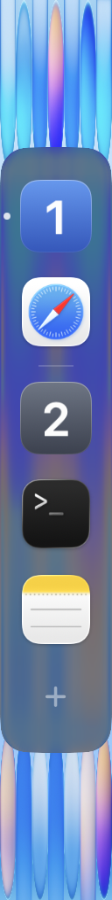
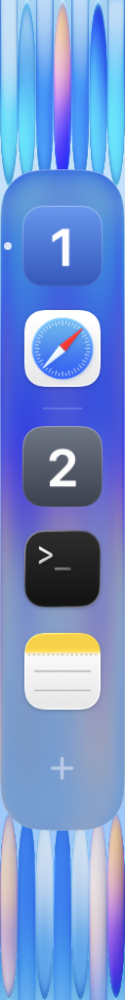
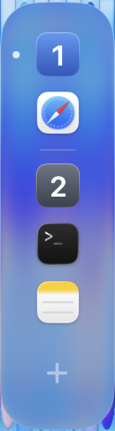
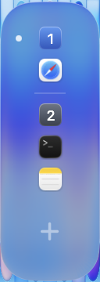

# Native Dock proportions and glass

The September 17 reference shows a roughly 167-pixel shelf, 104-pixel visible
icons, and 136-pixel spacing between icon centers. Scaling those proportions to
WinMux's fixed 64-point rail gives about 40 points of artwork and a 52-point pitch.

## Default geometry when space permits

| Measurement | Previous default | New default |
| --- | --- | --- |
| Fixed rail width | 64 pt | 64 pt |
| Icon canvas | 40 pt | 48 pt |
| Space between canvases | 6 pt | 4 pt |
| Icon-center pitch | 46 pt | 52 pt |
| Compact corner radius | 16 pt | 21⅓ pt |

App icons contain transparent padding. In the native preview, a 48-point canvas
paints approximately 39–41 points of artwork, depending on the icon. The number
tiles use the same canvas. Workspace separator margins remain fixed while the
magnification layout moves the separators. The icon-size setting still accepts
24–48 points as the maximum, and explicitly saved values override the new default.

## Liquid Glass implementation

Dock mode uses SwiftUI's public `.glassEffect(.clear.interactive(false), in:)`
on one background surface throughout expansion. Apple's
[Liquid Glass guidance](https://developer.apple.com/videos/play/wwdc2025/219/)
describes clear glass as more transparent than the adaptive regular variant.
This choice brings more wallpaper color through than the previous `.regular`
surface; it is an approximation of the reference, not Apple's internal Dock recipe.

The default `glass-opacity = 1.0` retains the full glass effect. A fine inner rim
keeps the clipped shelf edge visible without another glass layer. One outer clip
contains the material; icons and text remain outside the opacity adjustment.
Sidebar mode retains its dark material. Solid, Reduce Transparency, and older
macOS fallbacks retain their existing behavior.

## Native comparison and validation

These are real WindowServer captures of production views in the isolated preview,
using sample workspaces and the same bundled wallpaper. Both material comparison
captures use 48-point icons; the previous capture explicitly selected that size.

| Previous regular glass | Updated clear glass and spacing |
| --- | --- |
|  |  |

Pinned Swift 6.2.4, ARM64: 227 focused sidebar tests and the full 786-test suite,
each with three expected skips and zero failures, plus the application build.
Static native checks cover light/dark appearance, reduced opacity, compact/half/full
expansion, and magnified icons. Live mouse, drag, multi-monitor, and physical
120 Hz behavior were not remeasured for this appearance change.

## Adaptive sizing

Dock icons and workspace numbers now shrink uniformly when their resting column
exceeds the available height. The fit reserves space for separators, the create
button, monitor selector, project controls, clock, and expansion arrow. It uses
the displayed project and monitor filter; unrelated projects do not reduce the size.
While swiping projects, both visible pages use a size that fits the larger page.

The saved `dock-icon-size` remains the maximum. Icons grow back when items close
or more height becomes available. The fixed rail stays 64 points wide. Sizes stop
at 16 points; exceptionally crowded lists remain scrollable with every app retained.

Fitting uses the parent viewport before the animation host, without publishing
measurements back into view state or changing the configuration. Magnification
uses the fitted size and never feeds its enlargement back into the fit calculation.
Drag previews use counts from before the preview was applied, avoiding a loop in
which a preview resizes its own hover target. Committed model changes refit normally.

Native preview captures, all with a configured maximum of 48 points:

| 508 pt available → 48 pt icons | 240 pt available → 28.5 pt icons | 180 pt available → 16.5 pt icons |
| --- | --- | --- |
|  |  |  |

Validation: Swift 6.2.4 ARM64 build; 234 sidebar tests and 793 total tests, three
expected skips and zero failures. New tests cover the fit budget, all-icon visibility,
live count/height changes, controls, configured-size restoration, filtered scopes,
drag stability, and magnified native geometry. Captures use the isolated production
preview; physical multi-monitor and live drag sessions were not repeated.

## Independent code review

Claude CLI (`claude-fable-5`) and agy CLI (`gemini-3.8-flash-high`) reviewed commits
`5d153de9` and `48ebb298` on September 17. Claude inspected the patch and surrounding
files using read-only tools. agy received a scoped source bundle after its headless
file-read request was denied. Reports are retained under ignored
`.local/reviews/dock-adaptive-20260917/`.

Neither review established a new functional defect after source verification.
agy initially flagged drag-driven shelf movement, transparent overflow capturing
input, and a legacy header using the wrong size. Follow-up inspection showed that
projected shelf-height changes already use the existing settle animation; native
input accepts only the visible surface and measured icons; and Dock rendering
bypasses that legacy header. agy withdrew those findings.

Claude noted optional cleanup: duplicate page filtering outside the per-frame
callback and a conservative overflow reserve based on the configured maximum.
Neither demonstrated a user-visible regression or measured performance problem.
Workspace-name uniqueness remains an existing model invariant, and actual workspace
changes intentionally refit during a drag. No application code changed for this review.

Both reviews found meaningful coverage for the fit budget, restoration, filtering,
and drag-preview sizing. Additional coverage could exercise a fitted compact-to-expanded
morph and a swipe between differently populated projects. The reviews do not establish
physical 120 Hz smoothness or replace the outstanding live multi-monitor drag checks.
The 793-test/build results above are from the implementation validation; this
documentation-only follow-up did not rerun the application suite.
