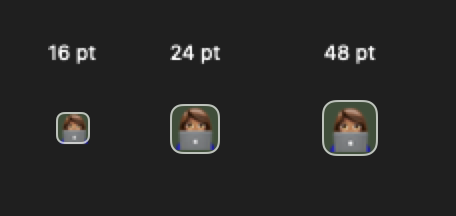

# Dock project emoji indicators

Right-click a project indicator and choose **Set Project Emoji…**.
Enter or paste one emoji, or press **Control–Command–Space** to open the macOS
emoji picker, then click **Save**. Flags, skin tones, and joined emoji are supported.
The indicator updates immediately. Clicking it still switches projects, and the
selected project has a highlighted outline. Project names remain in tooltips and
accessibility labels.

Choose **Reset Project Indicator** from the same menu to restore the colored bar.
Projects without a configured emoji retain their bars. Workspace-number tiles are
unaffected.

The expanded Dock and Sidebar show emoji in the project switcher at the bottom. The
current project's indicator also shows its name, and the **+** button beside the
switcher creates a project. The collapsed Sidebar rail keeps the original bars.

You can also configure emoji by stable project ID in TOML:

```toml
[workspace-sidebar.project-emojis]
"default" = "🏠"
"project-1" = "👩🏽‍💻"
```

Use `winmux list-projects` to find project IDs. Emoji follow projects when renamed
and are removed with project metadata when a project is deleted.

## Rendering check

Native view fixture at adaptive 16-point, configured 24-point, and configured
48-point Dock icon sizes. This shows the selected project indicator, not the
installed app.


