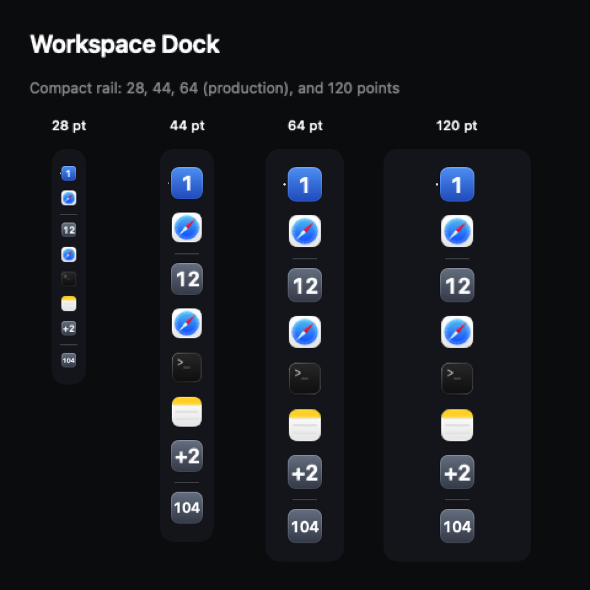
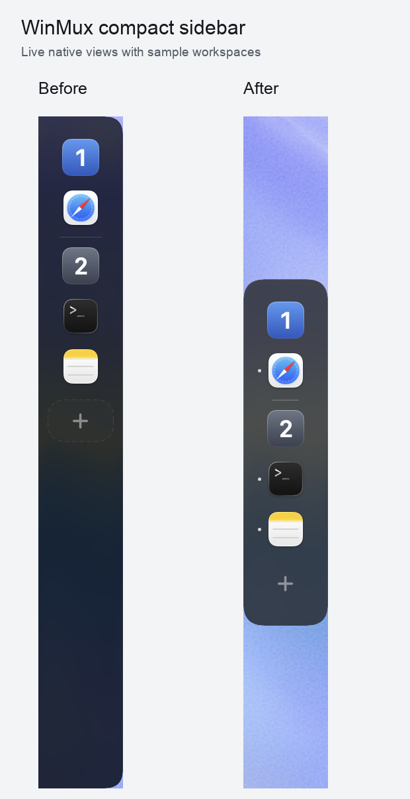
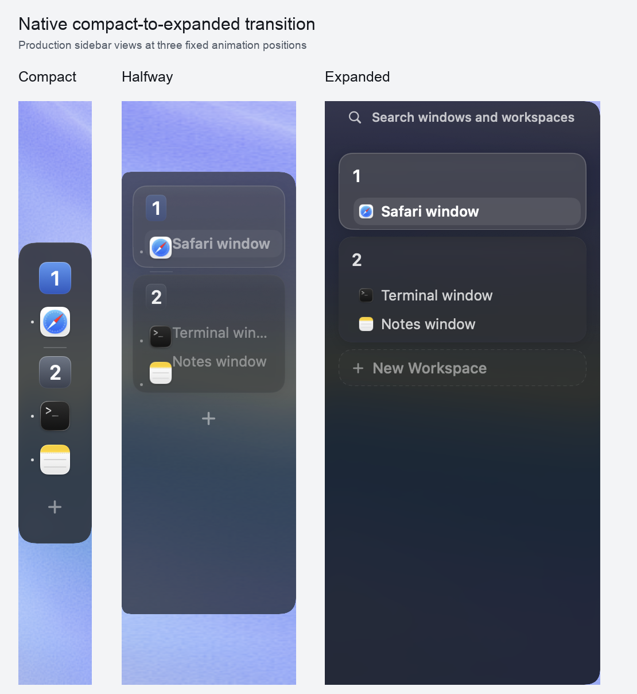

# Sidebar appearance validation

The optional compact app-icon mode and sidebar glass opacity control preserve the
existing appearance by default (`show-app-icons = false`, `glass-opacity = 1.0`).
Both controls are in **Settings → Appearance → Sidebar**; configuration examples
are in the [README](../README.md#workspace-app-icons-and-glass-opacity).

## Automated checks

Validated on September 16, 2026 with Swift **6.2.4**:

- **166 focused sidebar tests passed.**
- **720 tests passed** in the complete application suite.
- Debug application/CLI build and `git diff --check` passed.
- [CI passed for `23b55258`](https://github.com/alanzchen/winmux/actions/runs/35163648568).
- The universal Developer ID-signed and notarized DMG passed distribution checks;
  see the [release validation record](releasing.md#clickable-dock-icons-build--september-16-2026).

```sh
swift test --filter WorkspaceSidebar
swift test
swift build
```

Coverage includes strict opacity parsing (including nonfinite values), backwards
defaults, settings persistence, nested tiled/tabbed and floating app summaries,
deduplication, search preservation, numeric labels, overflow, and accessibility
labels. Review also checked that optimistic workspace selection keeps app summaries
and that the new layout does not resize shared monitor/project controls.

The app-icon rail uses a vertical Dock-style column: equal-sized workspace number
tiles and app icons, with horizontal separators between workspaces. It uses a fixed
64-point compact width, including auto-hide; the stored collapsed width is restored
when app icons are disabled. Number tiles fade into workspace titles and app icons move to
their expanded row positions while measured heights interpolate. Separators fade
without changing row spacing. Regression coverage includes
widths 28/44/120, empty and crowded workspaces, duplicate apps, filtered tab groups,
summary-only apps, and both sides of the former row-reveal threshold. The 28/44/120
rendering cases stress component bounds; production Dock mode resolves to 64 points.
The rendering checks and preview also include the production 64-point width.

Six geometry regressions cover the centered compact surface, full-height expansion,
tall scrolling content, clock/display/project reserves, clipping invisible drag targets,
and keeping the original target under the pointer when a drag preview appears.
Each native panel caches its own local targets and reprojects them after moving or
showing, including same-size display rearrangements.

## Dock icon actions

Clicking an app icon selects its current eligible window, or a matching window
using the workspace's tree focus order, and raises it after layout and ordinary
focus synchronization.
The action resolves live windows, including nested tab groups and floating windows.
An occupied workspace retains the clicked app through the existing **Override**
prompt; cancellation leaves its monitor assignment unchanged. Clicking a workspace
number continues to select the workspace. Hit targets follow the rendered icons
during expansion; ordinary window rows take over when fully expanded.

Seventeen new regressions cover app identity and recency, hidden and occupied
workspaces, explicit Override, cancellation, dragging, monitor removal, stale
windows, logical-focus equality, and native focus ordering. Final native focus
revalidates the target so a closed, moved, hidden, or newly ineligible window is
not raised.

Dock app icons now use the same drag gesture, cursor preview, and workspace drop
targets as expanded window rows. A drag resolves the same eligible window as a
click and pins that window until release, even if focus changes. Only that window
moves; floating layout is preserved. Five regressions cover pinned selection,
missing windows, repeated gestures, a disconnected panel, and moving one app window
while leaving its siblings in the source workspace.

Live pointer, drag-and-drop, and VoiceOver activation remain unverified because the Mac was locked.
A detached `NSHostingView` exposed no native accessibility children, including for
the existing workspace buttons, so that experiment was not counted as an input
verification pass. The automated action and geometry checks do not substitute for
clicking icons in the running app.

## Native rendering

Detached `NSHostingView` tests rendered actual workspace sections at 28-, 44-, and
120-point rail widths with 0, 1, 3, 6, and 104 apps. Pixel bounds checks passed.
The Dock preview includes real app icons, active and inactive workspaces, separators,
and an empty workspace. It was visually inspected:
`.build/sidebar-appearance-ui/workspace-app-icons-preview.png`.



This is a detached rendering of the actual SwiftUI components, including the
production 64-point rail. It is not a desktop screenshot or a live drag test.

Actual workspace cards were also rendered at six intermediate expansion positions.
Anchor checks verified equal square number/app tiles, a fixed compact column, and mounted destinations;
height checks verified continuous expansion for empty, single-window, and grouped
workspaces. A pixel regression verifies numeric labels remain readable at all five
preview positions. Numeric and long workspace labels were visually inspected in the morph
preview: `.build/sidebar-morph-ui/workspace-app-icons-morph-preview.png`.

The actual sidebar surface was rendered at 0%, 40%, and 100% opacity. Its background
alpha changed while the foreground pixels stayed unchanged. Solid surfaces remained
opaque at all three values. Workspace card glass uses the same configured opacity.

These detached checks open no windows and change no user configuration.

## Earlier Dockset reference comparison

Used the live [Dockset website](https://dockset.app/) in **Custom Dock → Left →
Dark/Glass** as the reference. Its measured rail was approximately 62.8 pixels wide,
with 15.4-pixel corners, a 19.6 × 1-pixel divider, and 2.8-pixel running dots.
That revision used 64-point width, 16-point corners, 20 × 1-point dividers, and 2.5-point dots.
Its indicator is a single dot to the left of the active workspace number, following
the number and fading during expansion. App icons have no dots. The comparison
captures below predate this indicator adjustment.
That revision's compact glass uses a neutral dark tint and a subtle upper-edge highlight.
Its height fits the workspaces and controls, centered within the available area.



These are **real WindowServer captures of the production sidebar view in a dedicated
native preview window**, with sample workspaces. The before view uses `a75368c9` in
an isolated checkout; both use the identical wallpaper crop and 64 × 508-point canvas.
Only the preview window is captured. The reference is a browser screenshot of Dockset;
it is not a screenshot of the installed macOS Dock. Different contents and rendering
engines make a pixel-identical reference comparison inappropriate. Native rendering
was inspected after two refinement iterations; a before/after pixel-difference image
is retained locally in `.build/dock-visual-match/`.



Live native captures at 0%, 50%, and 100% expansion verify the surface and icon positions.
Reproduce with the existing development renderer; `--expansion` accepts 0–1:

```sh
swift run winmux-marketing-renderer --sidebar-dock-proof \
  --width 64 --height 508 --expansion 0.5 --hold-seconds 0 \
  --output /tmp/winmux-sidebar.png
```

The harness never starts window management or reads the user's configuration.
Interactive hover/reverse timing, mouse/VoiceOver operation of settings, and real
multi-monitor movement still need manual checks in the running app. Existing search,
rename, drag, Override, sidebar layering, and settings scroll-retention behavior remains
covered by regressions; these screenshots do not establish live input behavior.

## Native Dock refinement — September 16, 2026

The supplied macOS Dock screenshot informed a larger **4-point active-workspace
dot**, centered in the left gutter. App icons and number tiles now default to
**40 points**, configurable from **24–48** with `dock-icon-size`. The rail remains
64 points wide. The earlier screenshots above predate these changes.

On macOS 26+, the compact surface uses SwiftUI's native
`glassEffect(.regular.interactive(false), in:)`, without the previous dark overlay
and artificial border. Background opacity, solid style, Reduce Transparency, and
the older-system material fallback remain available.

Optional `dock-magnification = true` enlarges nearby icons up to 1.5×, capped at
52 points. Fixed vertical reserves prevent overlap and rail-height changes.
Hover keeps the rail compact; the arrow or sidebar command expands it. Auto-hide
reveal remains fully compact. Menus, editing, drags, and Reduce Motion suppress
magnification. Compact drag cursor and destination previews retain icon form;
expanded row previews retain their existing appearance.

Swift 6.2.4 validation: **731 tests, zero failures, one skip**, plus a successful
debug build. New regressions cover settings persistence and bounds, gutter
alignment, magnification geometry and native SwiftUI anchors, auto-hide expansion,
drag identity, and icon-only cursor/target renderings with differing window titles.

The skipped test requires WindowServer to render native Liquid Glass: detached
hosting views rendered no glass background, while foreground-opacity assertions
passed. One earlier real preview capture showed the new glass and dot at the old
32-point size. Subsequent captures returned blank; no final screenshot or live
hover, click, drag, Reduce Motion, or multi-monitor smoke pass is claimed.

The isolated preview renderer accepts `--icon-size 24|40|48`, `--magnification 1`,
`--pointer-y <points>`, `--glass-opacity 0…1`, and `--appearance light|dark`.
Injected pointer coordinates provide a visual fixture, not a live-input test.

### Hover boundaries, live appearance, and complete app lists

Follow-up fixes limit hover tracking to the Dock surface and reject points outside
its rounded path, including transparent panel space beside, above, and below it.
This follows Apple's documented
[view-bound hover region](https://developer.apple.com/documentation/swiftui/view/oncontinuoushover(coordinatespace:perform:)).
The coordinate space is shared with icon geometry; leaving the region clears
magnification. Workspace-number glyphs scale from a fixed font layout instead of
changing font size at every animated geometry update, addressing hover flicker.

Panel models now publish equality-checked appearance snapshots on configuration
reload. Icon size, glass opacity, and magnification update without pointer movement
or workspace changes; explicitly expanded panels also adopt width changes.
All workspace app icons render and scroll; the three-app cap and `+N` tile are removed.

The full suite passed **733 tests, zero failures, one native-glass skip**. Regression
coverage includes outside/rounded-corner hover rejection, appearance-only model
notifications, all seven native icon anchors, and longer magnified columns. The
desktop-control tool still times out, so a live flicker/hover/settings smoke pass
is not claimed.

Native preview capture subsequently succeeded. These are real WindowServer
captures of the production sidebar with fixture workspaces and injected pointer
coordinates: [inside the Dock](images/sidebar-dock-hover-inside.png) and
[above the Dock](images/sidebar-dock-hover-outside.png). The outside sample keeps
all tiles at resting size; the inside sample magnifies nearby tiles. Both show
readable number glyphs. Static captures do not establish flicker-free live motion.

## Dedicated modes — local implementation, not released

`[workspace-sidebar] mode = 'sidebar' | 'dock'` now selects the presentation.
Sidebar is the default and keeps the upstream dark `GlassSurface` recipe and
original layout. Dock retains app icons, fixed compact width, magnification,
Liquid Glass, and opacity control. Dock-only settings are shown only for Dock in
Appearance. Other window chrome keeps its existing configurable style.

Legacy `show-app-icons` selects the mode when `mode` is absent. Explicit mode wins
regardless of TOML key order. Mode switches update the panel immediately and retain
the saved Sidebar width and Dock preferences. Sidebar surfaces and workspace cards
ignore Dock opacity and use the upstream dark style.

Validation: **737 tests, zero failures, one native-glass skip**, and a successful
debug build. New regressions cover migration, precedence, invalid modes, saved
preferences, live appearance snapshots, and identical Sidebar bitmap rendering
across Dock style/opacity changes. A native mode-preview capture returned blank;
live mode-selector interaction and final WindowServer visuals remain unverified.
The preview renderer supports `--mode sidebar|dock` for the next native check.

Per user request, this work is local only: no release or release workflow was
triggered, and the preview update feed remains on the existing published version.

### Dock lift and drop handoff — local, not released

Compact icon drags hide the source icon while retaining its layout slot, including
icons rendered through the compact/expanded morph overlay. Cancellation restores
the source. A committed drop keeps its visual destination placeholder across the
asynchronous workspace update; arrival is matched by window ID, not app identity.
The updated app list, placeholder removal, and Dock height share a 0.28-second
spring. Reduce Motion disables movement. The underlying window-move semantics
remain unchanged, including one-window moves for apps with multiple windows.

Visual handoffs are scoped to a gesture ID. Completion, cancellation, a newer drag,
disabled sidebar state, or a bounded failure timeout clear them; old completion
callbacks cannot clear a newer drag. Sidebar mode does not use this presentation.

Validation: **743 tests, zero failures, one native-glass skip**, plus a successful
debug build. Six new regressions exercise source-icon pixel visibility with stable
layout, destination arrival, same-app/different-window handling, new workspaces,
cancellation, superseded gestures, and Sidebar-mode isolation. Live animation timing
and an interactive native drag still require a smoke check. Nothing was pushed or
released.
