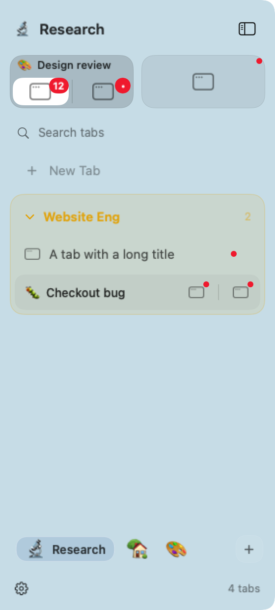

# Tabs: split identity, group continuity and menu splitting

Named split tabs now display their name and emoji alongside separate window
buttons. Each member keeps its own focus highlight, full-title tooltip, menu and
close accessibility action. Pinned splits place their identity above the member
buttons; a custom emoji no longer replaces both targets in a compact pair.
Unnamed splits calculate their title space using the live badge width. Their
hover close button covers the end of the title while badges keep a separate slot.

A new window from the same app as the focused window inherits that tab's group
when the app is frontmost. It still opens in a separate tab. Background windows,
other apps, startup restoration and explicit window-detected placement retain
their existing routing. The active group's disclosure behavior is unchanged.
Inherited tabs disappear from the sidebar when closed. Their reserved identities
follow the existing restoration policy: closing a window uses a brief grace
period, while quitting an app preserves its group for a later relaunch. Explicit
Save, Pin, Rename or group assignment still keeps an empty tab. Reordering within
the same group and detaching a split member do not enable that setting. Project
switching skips hidden restoration identities and creates an ordinary empty tab
when the project has no visible candidates.

The tab identity menu keeps organization, split separation, persistence and
closing actions together. Settings remain available from the sidebar gear.
**Split with** lists eligible tabs in sidebar order, within the same project and
display. It moves only the clicked window to the right of the destination,
preserving the destination's identity and other windows. Floating and fullscreen
windows are excluded. A moved source or stale destination is rejected when the
action runs, using stable workspace IDs even if a name has been reused. Menu
splitting participates in the existing one-step sidebar Undo.

Collapsed group rows no longer own the sole numeric app badge. The next drawn
occurrence carries the count; active groups and search use their expanded rows.
Other instances still show activity dots, as does the compact rail.

## Native renderings

AppKit fixtures with placeholder app icons and synthetic Dock badge labels:

[Narrow sidebar](images/tabs-identity-narrow.png) ·
[Compact rail](images/tabs-identity-compact.png)

## Validation

Swift 6.4 on Apple Silicon. Focused lifecycle/sidebar tests and 87 final project/tab
regressions passed. The final full suite ran 1,520 tests with seven opt-in skips
and zero failures. The final app and CLI build passed; both binaries contain
only `arm64`. The new identity suite contains 25 behavior and native-click tests.

Regression coverage includes same-app group inheritance and its background,
startup, restoration, other-mode, other-app and placement-rule exceptions;
close cleanup, late app relaunch, minimized/hidden windows, explicit retention,
same-group reorder, detach, cleanup write backoff and restoration placeholders;
split target order, per-member movement, destination identity, Undo and stale
destinations, including recycled names and a pruned source restored through the
full sidebar session; project fallbacks that skip hidden restoration identities;
menu sections; badge ownership for collapsed and active groups;
live badge width in split layout; and native clicks on named split members at
180/280 points, eight split members at 180 points, and pinned pairs at
expanded/compact widths.

Independent read-only Claude Opus 5.5 and Gemini 3.8 Flash High reviews are kept
under ignored `.local/reviews/tabs-identity-*`. Accepted findings led to automatic
identity retention, restoration and cleanup fixes; stable split destination IDs;
narrow split fitting; measured title space; and pinned-label accessibility.
Opus and Gemini found no blockers in the final lifecycle, visibility and
project-fallback follow-ups. Reviews were static and did not replace the tests.

Named split icons intentionally use per-member menus, middle-click and the
accessibility Close action instead of placing a hover X over the selection icon.
Pinned dragging and broader search/keyboard changes remain a later pass.

## Compatibility

Existing saved records keep their prior behavior. An automatic identity cannot
be promoted to a kept tab when the saved file is read-only; the existing error
explains why the change could not persist. Automatic inheritance skips such stores.
App restoration uses the existing title/order matching policy, including the
next window an app opens after a quit. An empty automatic tab stays internally
reserved for this purpose until restored or forgotten.
Older WinMux builds do not understand the optional retention field; using one to
rewrite this saved file can turn automatic identities into kept tabs on upgrade.

## Remaining manual checks

Real third-party window creation, save sheets, Dock badge delivery, physical
multi-monitor use, compositor timing and VoiceOver/Full Keyboard Access need
manual smoke checks in the app. Fixture clicks and synthetic monitor tests do not
replace those checks. Remaining review follow-ups include profiling large
sidebars with many restoration identities, a rename racing with the last window
closing, and project navigation while an automatic empty tab is still on screen.
