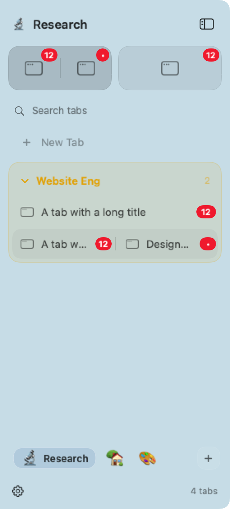

# Tabs sidebar: pinned splits, projects, badges, and groups

Pinned workspaces now show every tiled window in one joined tile. Each segment
selects its own window; two windows of the same app remain separate. The grid
adapts to the available width. The compact rail also shows a pair's icons; larger
splits and customized emoji retain a single workspace target in that narrow rail.

The original project switcher is fixed at the bottom, with its emoji/color
controls, current-project pill, menus, and page-slide animation. Project names
and the create button adapt to the Tabs surface's text color.

Tabs panels use the same final bottom boundary as standard tiled windows,
including the monitor's visible area, outer bottom gap, and macOS one-point
layout allowance. This changes the native panel frame, so its surface and input
area stop at that boundary too. Other modes keep their existing panel bounds.

The existing opt-in **Show app badges** setting is available in Tabs as well as
Dock mode. Both modes share the existing macOS Dock badge reader. Ordinary tabs
and split segments show red labels on the right; hovering reveals the close
button in the same slot. Pinned tiles show each app's badge beside its icon,
and compact icons show small red dots. Badge count updates observe the shared
model directly, without rebuilding the sidebar snapshot. An app must expose
its label through the macOS Dock for mirroring to work.

An active group on the sidebar's display remains fully expanded, as requested.
An active member on another display does not lock this sidebar's group open.
Rows, disclosure arrow,
accessibility value, menu action, and command handling now agree. The saved
collapsed preference applies again after the group becomes inactive. Searching
temporarily expands matching groups without changing that preference.

## Native renderings

These AppKit test fixtures use placeholder app icons and synthetic badge labels.

[Narrow sidebar](images/tabs-sidebar-narrow.png) ·
[Compact sidebar](images/tabs-sidebar-compact.png) ·
[Project transition: before, during, after](images/tabs-sidebar-project-transition.png)

## Validation

Swift 6.4, arm64 only. Focused checks cover native mouse clicks on both halves of
a pinned split, duplicate-app window identity, adaptive grid sizing, live badge
count changes and removal, badge pixel bounds, settings visibility and polling,
actual split layout after width/gap changes, offset-monitor coordinate conversion,
the native panel's monitor-to-screen wiring, active/inactive group rendering and
menus on separate displays, and animated project switching. Selecting a split
member retains the workspace's target-display placement and takeover rules.

The project animation regression mounts the full sidebar in a native window,
captures the transition, and verifies that the settled view matches a fresh
render of the selected project.

The final full suite passed with 1,472 tests, seven skips, and zero failures. The arm64
app and CLI build passed, and both executables were checked for arm64-only
architecture. Review follow-up tests passed: 74 tests, zero failures. After the
last compact accessibility selection correction, all 14 focused native/sidebar
tests passed again. The final group-menu destination checks passed with 43 focused
tests, including all 15 tests in the new sidebar regression class.

## Remaining native checks

AppKit rendering and synthetic mouse input ran on the available macOS window
server. Live third-party accessibility badge delivery, physical multi-monitor
and Dock-placement changes, and compositor timing still need manual checks in
the built app. Synthetic monitor/layout tests cover the geometry calculations.

Manual checks: pin a window, tile another beside it, and select both segments;
switch projects repeatedly and check the animated pill and page; resize the
sidebar and change the bottom gap; collapse/reopen the sidebar; check unread
counts in both a split and a pinned tile; try collapsing the active group from
its header and menu, then focus outside it and collapse it normally.

Read-only review source bundles and reports are kept under ignored
`.local/reviews/tabs-polish-*`.

Gemini 3.8 Flash High found a search-time context menu mismatch. The collection
menu now receives the search state, so it agrees with the expanded rows and
arrow; a regression covers a saved-collapsed group during search. The review
also prompted caching each pinned tile's window list once per render and
removing a redundant outer accessibility label. Existing pager padding and
extreme-gap clamping behavior were verified against the unchanged implementation.
Gemini's targeted follow-up verified the fixes and reported no remaining blocking
findings; the padding, live-state, and clamping concerns were withdrawn after
reviewing the full context.

Claude Opus 5 found the cross-display group restriction and overbroad pinned-grid
animation trigger. Collapse protection now uses the sidebar's target display;
animation follows workspace/window membership rather than title or focus updates.
The review also led to preserving compact targets for larger splits and reusing
one padded geometry read for both physical and virtual layout. Native test waits
now follow observed events, rendering asserts badge pixels, and width checks
explicitly enable sidebar reservation. Final targeted reviews cover these changes
and the split-member display-routing correction.
Gemini verified the compact summary's corrected selection trait and withdrew its
concern about the intentionally named accessibility group: `.contain` preserves
the separate window buttons and their labels.

The final scope follow-up also aligns unresolved/default scope behavior and
anchors collection menus to their originating sidebar. A keyboard-opened menu
uses that display's group state and action destination even with the pointer on
another monitor. The native panel's action adapter already carries its physical
display scope; the list's separate create/drop destination does not replace it.
The group menu carries that create destination separately, so **New Tab in Group**
and the adjacent **New Tab** row honor the same monitor selector. A regression
invokes the menu entries and checks both their origin and destination actions.

Both reviewers' final targeted verdicts reported no confirmed blocking defects.
Claude's remaining create-scope check was verified against the live panel/model
builders and the existing Default/Focused/explicit-monitor creation tests:
physical target and focused scope IDs are populated from monitor coordinates;
the creation helper resolves selector sentinels to those IDs before a live menu
receives its destination. Empty preview snapshots do not provide active tabs.
