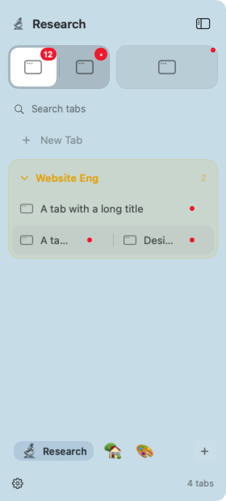

# Tabs: predictable navigation and reversible sidebar edits

Dragging across a row initially shows an insertion line. Holding still over one
half for 400 ms changes the preview to **Split left** or **Split right**; moving
to another row or half starts a new hold. Search results do not accept layout
drags, because a search may hide some members of a split.

The most recent sidebar move, split, detach, pin, group, or appearance edit gets
an Undo chip above the project switcher. Command-Z also invokes it while Search
Tabs owns keyboard input, using the current keyboard layout; it does not intercept another application's Undo
or rename editing. Closing windows is not undoable. A later layout,
organization, saved-identity, or monitor change invalidates an older Undo.
Undo preserves real window identities, split weights, and inactive tabs' focus
history, including when splitting had removed an empty source tab. Later
navigation on either display is preserved. Native window arrivals/container
transitions and interleaved sessions suppress an unsafe Undo entry.

Pins appear first, then groups at their first member's position. Sidebar rows,
the compact rail, next/previous tab commands, and numeric workspace shortcuts
in Tabs mode use that order, including named tabs. Unpinning restores the tab's
place in the underlying order. Explicit CLI `--stdin` order and navigation in
other modes remain unchanged. Numeric `move-node-to-workspace` destinations
and automatic tab numbers use that same order.

Search includes all projects, names matching groups, and displays project
headings. Its arrow keys and Enter use the same ordered results that are drawn.
The current project appears first. An empty search stays within that project.

Each split segment has its own identity menu: **Close Window** closes that
member; **Move [App] to New Tab** detaches it while retaining its group. **Move
to Project** moves the whole tab. **Close All Windows in Split…** asks before
closing and stops if an app keeps a window open for a save sheet. Tabs menus no
longer expose **Delete Workspace**, which would merge its windows into a neighbor.

App badges have a separate space beside the close target. The first occurrence
of an app carries its shared Dock count; other occurrences show activity dots.
Collapsed groups show member icons and an activity dot. Narrow splits use
separate icon targets, full-title tooltips, and window-specific menus. Active
styling respects the sidebar's display; a pinned split highlights its focused
member. Compact mode preserves pin separation, group colors, and project emojis.
The project footer keeps space for neighboring projects and retains its animation.

## Native renderings

AppKit fixtures with placeholder icons and synthetic Dock labels:

[Narrow split targets](images/tabs-ux-narrow.png) ·
[Compact rail](images/tabs-ux-compact.png)

## Validation

Swift 6.4, Apple Silicon only. The final full suite passed: 1,495 tests, seven opt-in
skips, zero failures. The arm64 app and CLI build passed; both binaries report
only `arm64`. The focused sidebar suite passed 554 tests. After review fixes,
76 focused navigation and UX tests passed, followed by the full suite including
all 23 new UX regressions.

Checks cover pin/group/keyboard order, cross-project and group-name search,
delayed split targeting, native clicks on all three narrow split segments,
search drop suppression, member-specific menus, badge pixel bounds and updates,
Undo after source pruning, closed-window invalidation, later-layout invalidation,
focus changes, detach/Undo, inactive split focus history, new-window/native
container invalidation, saved-record drift, normalized sessions, interleaved
commands, keyboard layouts, release at the split-hover boundary, floating
drops, and screen-coordinate conversion. Existing width,
bottom-boundary, group disclosure, and animated project-switch tests also pass.

Read-only reviewer bundles and reports are retained under ignored
`.local/reviews/tabs-ux-*`.

Review corrections preserve other displays during Undo, prevent orphaning new
or native-container windows, keep passive saved-record updates, commit only
the published drag preview, preserve row-specific drop destinations, retain
floating-window joins, and align move shortcuts with tab numbering. Claude Opus
5.5 and Gemini 3.8 Flash High's final targeted reviews both report no remaining
blockers. Initial missing-refresh
claims were withdrawn after reviewing the shared session; stack-container and
coordinate concerns were disproved by the full source and regression coverage.
The final narrow review also verified that three-display Undo conflicts resolve
independently of dictionary order, and that drag-preview state resets between
gestures. A possible label/focus mismatch was withdrawn after checking the
workspace visibility implementation.

## Remaining manual checks

Native AppKit rendering and synthetic clicks ran on the available window
server. Physical multi-monitor switching, live third-party save sheets and Dock
badge delivery, and compositor timing need manual smoke checks in the built app.
Synthetic monitor/layout tests cover the routing and geometry logic.
